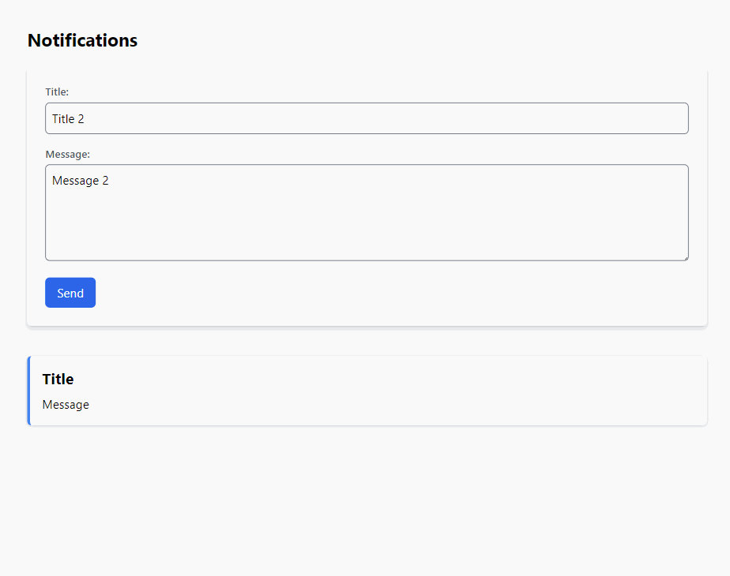

# Real-time Notification System

A simple real-time notification system using RabbitMQ, Express, and Socket.io.

## Table of Contents

- [Setup](#setup)
- [Usage](#usage)
- [Contributing](#contributing)
- [License](#license)

## Setup

### 1. RabbitMQ and Node Environment



Before starting, ensure that the RabbitMQ server is running.

Requirements
- Node
- RabbitMQ

Open on http://localhost:4000/


## 2. Producer

The producer is a simple API to create new notifications.

## 3. Consumer

The consumer listens for notifications from RabbitMQ and sends them in real-time to connected web clients using WebSockets.

## 4. Web Client for Displaying Notifications

This simple client will display notifications in real-time.

## Usage

You should have rabbitMQ and Erlang/OTP installed.

Requirements

- Node
- RabbitMQ

Setup

```bash
yarn install or npm install

```

Running

```bash
yarn serve

```

### Start the server:

```node server```

Open your browser and go to http://localhost:4000 to see notifications in real-time. Fill the form and press send.

## Contributing

This code is only for example purposes.

## License

This project is open source. Feel free to use, modify, and distribute as you see fit.
